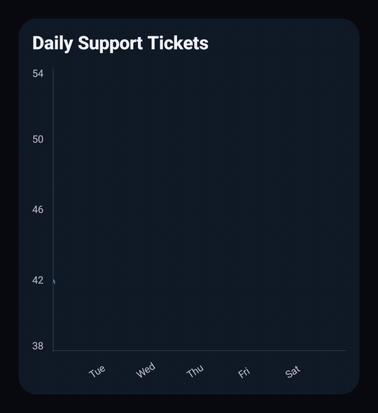

<p align="center">
  
</p>

<p align="center">
  <a href="https://central.sonatype.com/artifact/io.github.dautovicharis/charts/overview">
    
  </a>
  <a href="https://central.sonatype.com/repository/maven-snapshots/io/github/dautovicharis/charts/maven-metadata.xml">
    
  </a>
  
</p>

<p align="center">
  A Kotlin Multiplatform chart library built with Jetpack Compose.
</p>

<p align="center">


</p>

---

## Get Started

Add Charts to `commonMain`:

```kotlin
commonMain.dependencies {
    implementation("io.github.dautovicharis:charts:<version>")
}

dependencyResolutionManagement {
    repositories {
        mavenCentral()
    }
}
```

Basic example:



```kotlin
@Composable
fun BasicLineChart() {
    val values = listOf(42f, 38f, 45f, 51f, 47f, 54f, 49f)
    val labels = listOf("Mon", "Tue", "Wed", "Thu", "Fri", "Sat", "Sun")

    val dataSet = values.toChartDataSet(
        title = "Daily Support Tickets",
        labels = labels,
    )

    LineChart(dataSet)
}
```

<br clear="right" />

## Documentation
https://charts.harisdautovic.com/

## Production Demo (JS)
https://charts.harisdautovic.com/static/demo/2.1.0/index.html

## Snapshot Demo (JS)
https://charts.harisdautovic.com/static/demo/snapshot/index.html
