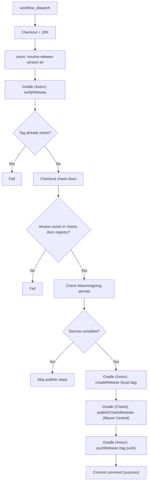

# Charts Release

Workflow: `charts/.github/workflows/release.yml`

```mermaid
flowchart TD
  A["workflow_dispatch"] --> B["Checkout + JDK"]
  B --> C["axion: resolve-release-version.sh"]
  C --> E["Gradle (Axion): verifyRelease"]
  E --> F{"Tag already exists?"}
  F -- Yes --> FX["Fail"]
  F -- No --> G["Checkout charts-docs"]
  G --> H{"Version exists in charts-docs registry?"}
  H -- No --> HX["Fail"]
  H -- Yes --> I["Check Maven/signing secrets"]
  I --> J{"Secrets complete?"}
  J -- No --> JX["Skip publish steps"]
  J -- Yes --> K["Gradle (Axion): createRelease (local tag)"]
  K --> L["Gradle (Charts): publishChartsModules (Maven Central)"]
  L --> M["Gradle (Axion): pushRelease (tag push)"]
  M --> N["Commit comment (success)"]
```
