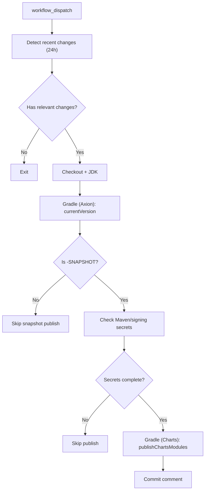

# Charts Snapshot

Workflow: `charts/.github/workflows/snapshot-release.yml`

```mermaid
flowchart TD
  A["workflow_dispatch"] --> B["Detect recent changes (24h)"]
  B --> C{"Has relevant changes?"}
  C -- No --> CX["Exit"]
  C -- Yes --> D["Checkout + JDK"]
  D --> E["Gradle (Axion): currentVersion"]
  E --> F{"Is -SNAPSHOT?"}
  F -- No --> FX["Skip snapshot publish"]
  F -- Yes --> G["Check Maven/signing secrets"]
  G --> H{"Secrets complete?"}
  H -- No --> HX["Skip publish"]
  H -- Yes --> I["Gradle (Charts): publishChartsModules"]
  I --> J["Commit comment"]
```
