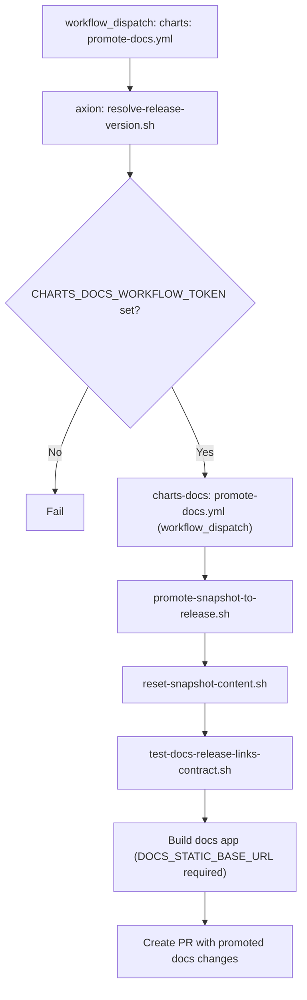

# Docs Promotion (Cross-Repo)

Workflow: `charts/.github/workflows/promote-docs.yml`

Notes:
- `promote-snapshot-to-release.sh`: copies `content/snapshot` to `content/{release_version}` and updates registry.
- `reset-snapshot-content.sh`: clears snapshot changes and resets breaking-changes baseline.
