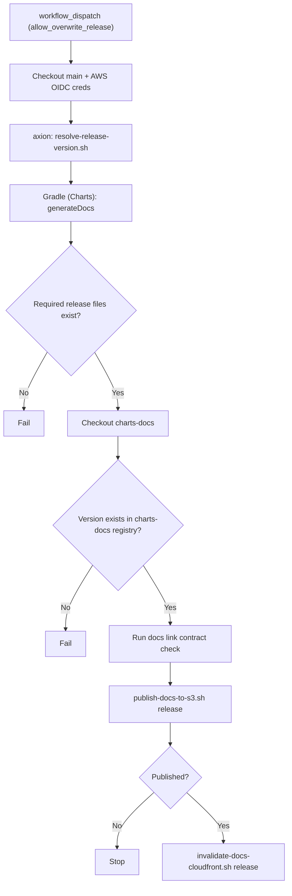

# Docs Release Publish

Workflow: `charts/.github/workflows/publish-docs-release.yml`

Required release files:
- `docs/static/api/{release_version}/index.html`
- `docs/static/demo/{release_version}/index.html`
