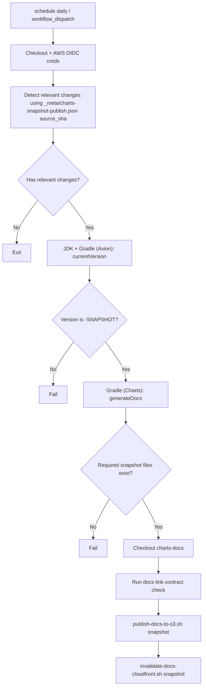

# Docs Snapshot Publish

Workflow: `charts/.github/workflows/publish-docs-snapshot.yml`

```mermaid
flowchart TD
  A["schedule daily / workflow_dispatch"] --> B["Checkout + AWS OIDC creds"]
  B --> C["Detect relevant changes using _meta/charts-snapshot-publish.json source_sha"]
  C --> D{"Has relevant changes?"}
  D -- No --> DX["Exit"]
  D -- Yes --> E["JDK + Gradle (Axion): currentVersion"]
  E --> F{"Version is -SNAPSHOT?"}
  F -- No --> FX["Fail"]
  F -- Yes --> G["Gradle (Charts): generateDocs"]
  G --> H{"Required snapshot files exist?"}
  H -- No --> HX["Fail"]
  H -- Yes --> I["Checkout charts-docs"]
  I --> J["Run docs link contract check"]
  J --> K["publish-docs-to-s3.sh snapshot"]
  K --> L["invalidate-docs-cloudfront.sh snapshot"]
```

Required snapshot files:
- `docs/static/api/snapshot/index.html`
- `docs/static/demo/snapshot/index.html`
