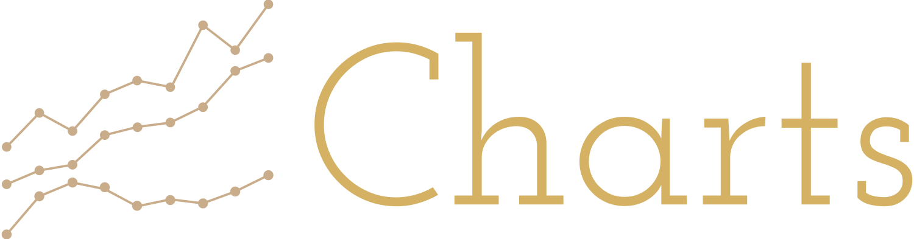

  

# Charts 2.0.1
Welcome to the Charts documentation! This library provides a simple way to create beautiful charts in Kotlin Multiplatform applications.

  

## What's New in 2.0.1

### 🐛 Fixes
- **ProGuard Configuration**: Fixed ProGuard rules to prevent issues with minified builds ([#225](https://github.com/dautovicharis/Charts/pull/225))

### ⬆️ Updates
- **Compose 1.9.2**: Updated to Compose Multiplatform 1.9.2 for improved performance and compatibility ([#234](https://github.com/dautovicharis/Charts/pull/234))
- **Dependencies**: Updated Gradle and other dependencies to latest stable versions ([#234](https://github.com/dautovicharis/Charts/pull/234))

### 📚 Documentation
- **Documentation Improvements**: Enhanced overall documentation quality ([#226](https://github.com/dautovicharis/Charts/pull/226))

### 🎨 Demo App
- **Theme Improvements**: Enhanced dark mode support and dynamic color handling ([#220](https://github.com/dautovicharis/Charts/pull/220))

### 🔧 CI/CD
- **Snapshot Releases**: Added automated snapshot release workflow ([#235](https://github.com/dautovicharis/Charts/pull/235), [#236](https://github.com/dautovicharis/Charts/pull/236))
- **Documentation Deployment**: Improved docs and JS demo generation workflows ([#237](https://github.com/dautovicharis/Charts/pull/237))

## Getting Started

New to Charts? Check out our [Getting Started Guide](getting-started.md) to learn how to integrate the library into your project and create your first charts in minutes.

## Interactive JS Demo
Explore the capabilities of Charts library with our interactive demo. This live showcase demonstrates all chart types and customization options available in the current version.

    <a href="jsdemo/index.html" target="_blank" style="display: inline-flex; align-items: center; background-color: var(--md-primary-fg-color); color: white; padding: 8px 16px; text-decoration: none; border-radius: 4px; font-weight: 500; font-size: 14px; box-shadow: 0 1px 3px rgba(0,0,0,0.12); transition: all 0.2s ease;">
        
            <svg xmlns="http://www.w3.org/2000/svg" viewBox="0 0 24 24" width="16" height="16" style="margin-right: 8px;">
                <path fill="currentColor" d="M8 5v14l11-7z"></path>
            </svg>
        
        Try Interactive Demo
    </a>

## Documentation
- [API Documentation](api/index.html) - Detailed API reference
- [Interactive Demo](jsdemo/index.html) - Explore all chart types and customization options
- [Examples](examples.md) - Code samples
- [Example Project](https://github.com/dautovicharis/Charts/tree/main/app/src/commonMain/kotlin/io/github/dautovicharis/charts/app/demo)